<div align="center">

# 🤲 Şeffaf Bağış Platformu

# 🔗 [Orijinal Repo → MFurkanAkdag/Donation\_Platform\_Bitirme\_Projesi](https://github.com/MFurkanAkdag/Donation_Platform_Bitirme_Projesi)

**Kanıtlanabilir şeffaflık. Güvenli bağış. Yapay zeka destekli akıllı asistan.**

Bağışçılar, ihtiyaç sahipleri, vakıflar ve sistem yöneticilerini tek çatı altında buluşturan; her bağışın nereye harcandığını kanıtlarla belgeleyen modern bir bağış platformu.


</div>

---

## 📌 İçindekiler

- [🎯 Proje Amacı](#-proje-amacı)
- [✨ Özellikler](#-özellikler)
- [👥 Kullanıcı Rolleri](#-kullanıcı-rolleri)
- [🏗️ Mimari](#️-mimari)
- [📸 Ekran Görüntüleri](#-ekran-görüntüleri)
- [🔥 Öne Çıkan Modüller](#-öne-çıkan-modüller)
- [🔒 Güvenlik & KVKK](#-güvenlik--kvkk)
- [🌐 API Referansı](#-api-referansı)
- [🗄️ Veritabanı](#️-veritabanı)
- [⚙️ Kurulum](#️-kurulum)
- [🔧 Ortam Değişkenleri](#-ortam-değişkenleri)

---

## 🎯 Proje Amacı

Bağış ekosisteminde en büyük sorun **güven eksikliği**dir. Bağışçılar paralarının nereye gittiğini bilmez; vakıflar güvenilirliklerini kanıtlayacak şeffaf bir mekanizmadan yoksundur.

**Şeffaf Bağış Platformu** bu sorunu çözer:

- Her kampanya için harcama **kanıtları** (fatura, makbuz, görsel) zorunlu tutulur
- Kanıtlar doğrultusunda algoritmik **Şeffaflık Skoru** hesaplanır
- AI destekli chatbot ile kullanıcılar kampanyaları **doğal dille** sorgular
- İhbar sistemi ile yardıma muhtaç kişiler **vakıf havuzuna** yönlendirilir
- KVKK uyumlu **AES-256-GCM şifreleme** ile hassas veriler korunur

---

## ✨ Özellikler

| Modül | Açıklama |
|-------|----------|
| 🏅 **Şeffaflık Skoru** | Vakıfların kanıt yükleme oranına göre otomatik hesaplanan 0-100 puan sistemi |
| 🤖 **AI Chatbot** | 6 araç (tool) kullanan, Redis hafızalı, 5 katmanlı güvenlikli akıllı asistan |
| 📢 **İhbar Hattı** | Yardıma ihtiyacı olan kişiler için vakıflara yönlendirme ve havuz sistemi |
| 🙋 **İhtiyaç Başvurusu** | Muhtaçların kampanyalara tek tıkla başvurabildiği profil sistemi |
| 💳 **Ödeme & Makbuz** | Iyzico entegrasyonu, 3D Secure, PDF barkodlu bağış makbuzu |
| 🔄 **Periyodik Bağış** | Aylık/haftalık otomatik bağış aboneliği |
| 👤 **Misafir Bağışı** | Kayıt olmadan sepetli bağış ve misafir ihbar |
| 📊 **Admin Paneli** | Kullanıcı, kampanya, vakıf ve ihbar yönetimi + denetim günlükleri |
| 📧 **E-posta Bildirimleri** | Şablon tabanlı otomatik bildirimler (doğrulama, şifre sıfırlama, güncelleme) |
| 🔔 **Anlık Bildirimler** | Spring Events ile event-driven bildirim sistemi |

---

## 👥 Kullanıcı Rolleri

```
┌─────────────────────────────────────────────────────────────────────┐
│                    ŞEFFAF BAĞIŞ PLATFORMU                           │
├──────────┬──────────┬──────────────┬──────────────┬────────────────┤
│  MİSAFİR │ BAĞIŞÇI  │ İHTİYAÇ SAH. │   VAKIF/ORG  │     ADMİN      │
├──────────┼──────────┼──────────────┼──────────────┼────────────────┤
│ Kampanya │ Kayıtlı  │ Onaylı       │ Kurumsal     │ Tüm platform   │
│ görüntüle│ bağış    │ muhtaçlık    │ doğrulanmış  │ yönetimi       │
│ İhbar    │ Makbuz   │ profili      │ vakıf        │                │
│ oluştur  │ indirme  │ Kampanyaya   │ Kampanya     │ Vakıf onaylama │
│ Misafir  │ AI chat  │ başvuru      │ başlatma     │ İhbar yönetimi │
│ bağış    │ Favori   │ Durum takibi │ İhbar havuzu │ Audit log      │
└──────────┴──────────┴──────────────┴──────────────┴────────────────┘
```

### Rol Detayları

<details>
<summary><b>🌐 Misafir (Guest)</b></summary>

- Tüm aktif kampanyaları ve kuruluşları filtreleyerek inceler
- Misafir bağışçı olarak sepetli/doğrudan bağış yapabilir
- İhbar Hattı üzerinden yardıma ihtiyacı olan biri için ihbar oluşturabilir
- Makbuz doğrulama sayfasına erişebilir
</details>

<details>
<summary><b>💚 Bağışçı (Donor)</b></summary>

- Kategoriye, bağış türüne ve konuma göre kampanya filtreler
- Tekli veya periyodik bağış yapar
- Barkodlu PDF makbuz indirir
- Favori vakıf listesi oluşturur, kampanya takip eder
- AI chatbot ile doğal dilde kampanya sorgular
</details>

<details>
<summary><b>🤲 İhtiyaç Sahibi (Beneficiary)</b></summary>

- Profil bilgilerini (adres, hane, gelir/gider, belgeler) sisteme girer
- Uygun kampanyalara tek tıkla başvurur — form tekrar doldurulmaz
- Başvurusunun durumunu (Beklemede / Onaylandı / Reddedildi) canlı takip eder
</details>

<details>
<summary><b>🏢 Vakıf / Kuruluş (Foundation)</b></summary>

- Kampanya oluşturur, günceller, harcama kanıtı yükler
- Gelen ihtiyaç sahibi başvurularını değerlendirir
- İhbar Havuzu'ndan ihbar sahiplenir, süreci yönetir
- Şeffaflık skorunu ve finansal istatistiklerini takip eder
</details>

<details>
<summary><b>🛠️ Admin</b></summary>

- Vakıf/kuruluş belgelerini inceler ve onaylar/reddeder
- Tüm kullanıcıları yönetir (rol, durum değişikliği)
- Şikayetleri, ihbarları ve audit logları denetler
- Platform geneli istatistik ve grafikleri görüntüler
</details>

---

## 🏗️ Mimari

### Genel Mimari

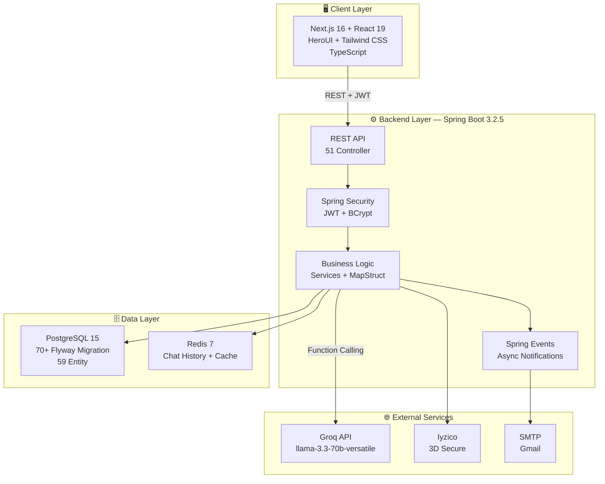
```mermaid
graph TB
    subgraph Client["🖥️ Client Layer"]
        FE["Next.js 16 + React 19<br/>HeroUI + Tailwind CSS<br/>TypeScript"]
    end

    subgraph Backend["⚙️ Backend Layer — Spring Boot 3.2.5"]
        API["REST API<br/>51 Controller"]
        SEC["Spring Security<br/>JWT + BCrypt"]
        SVC["Business Logic<br/>Services + MapStruct"]
        EV["Spring Events<br/>Async Notifications"]
    end

    subgraph Data["🗄️ Data Layer"]
        PG["PostgreSQL 15<br/>70+ Flyway Migration<br/>59 Entity"]
        RD["Redis 7<br/>Chat History + Cache"]
    end

    subgraph External["🌐 External Services"]
        LLM["Groq API<br/>llama-3.3-70b-versatile"]
        PAY["Iyzico<br/>3D Secure"]
        MAIL["SMTP<br/>Gmail"]
    end

    FE -->|"REST + JWT"| API
    API --> SEC
    SEC --> SVC
    SVC --> EV
    SVC --> PG
    SVC --> RD
    SVC -->|"Function Calling"| LLM
    SVC --> PAY
    EV --> MAIL
```

### Chatbot Mimarisi

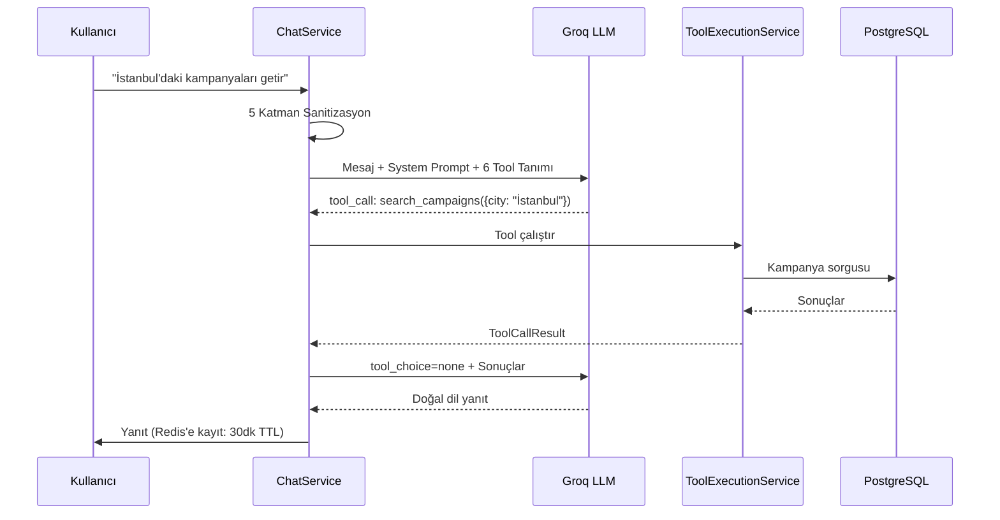
```mermaid
sequenceDiagram
    participant U as Kullanıcı
    participant CS as ChatService
    participant LLM as Groq LLM
    participant TS as ToolExecutionService
    participant DB as PostgreSQL

    U->>CS: "İstanbul'daki kampanyaları getir"
    CS->>CS: 5 Katman Sanitizasyon
    CS->>LLM: Mesaj + System Prompt + 6 Tool Tanımı
    LLM-->>CS: tool_call: search_campaigns({city: "İstanbul"})
    CS->>TS: Tool çalıştır
    TS->>DB: Kampanya sorgusu
    DB-->>TS: Sonuçlar
    TS-->>CS: ToolCallResult
    CS->>LLM: tool_choice=none + Sonuçlar
    LLM-->>CS: Doğal dil yanıt
    CS->>U: Yanıt (Redis'e kayıt: 30dk TTL)
```

### İhbar Akışı

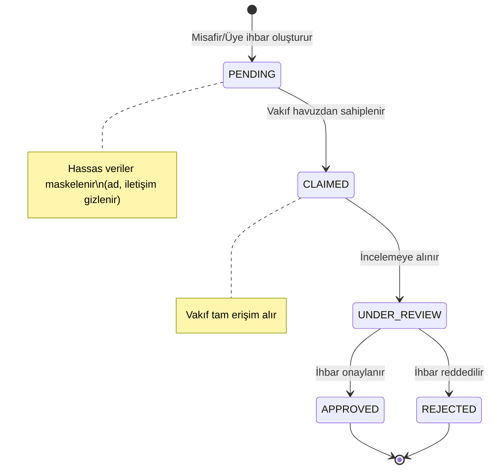
```mermaid
stateDiagram-v2
    [*] --> PENDING: Misafir/Üye ihbar oluşturur
    PENDING --> CLAIMED: Vakıf havuzdan sahiplenir
    CLAIMED --> UNDER_REVIEW: İncelemeye alınır
    UNDER_REVIEW --> APPROVED: İhbar onaylanır
    UNDER_REVIEW --> REJECTED: İhbar reddedilir
    APPROVED --> [*]
    REJECTED --> [*]

    note right of PENDING: Hassas veriler maskelenir\n(ad, iletişim gizlenir)
    note right of CLAIMED: Vakıf tam erişim alır
```

### Şeffaflık Skoru Hesaplama

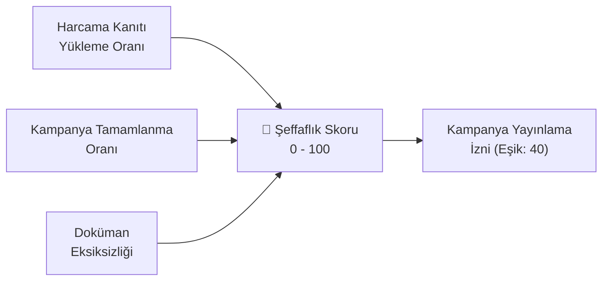
```mermaid
graph LR
    E["Harcama Kanıtı<br/>Yükleme Oranı"] --> S
    C["Kampanya Tamamlanma<br/>Oranı"] --> S
    D["Doküman<br/>Eksiksizliği"] --> S
    S["🏅 Şeffaflık Skoru<br/>0 - 100"] --> P["Kampanya Yayınlama<br/>İzni (Eşik: 40)"]
```

---

## 📸 Ekran Görüntüleri

### Ana Sayfa
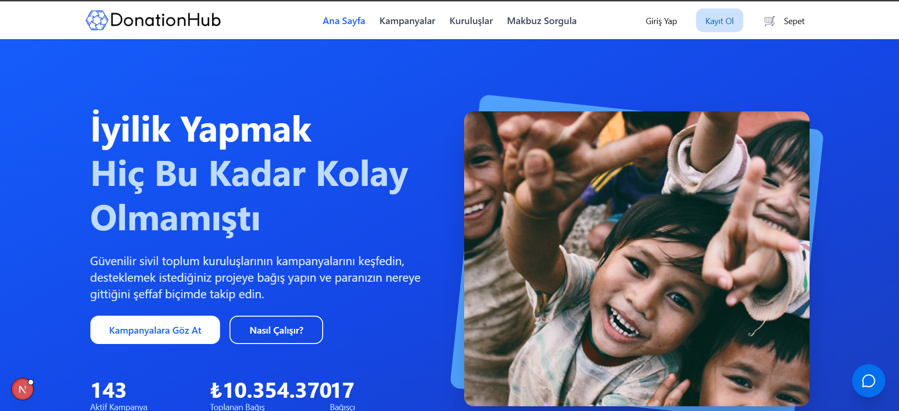
Platformun giriş ekranı: öne çıkan kampanyalar, istatistikler ve hızlı bağış seçenekleri.

### Kampanyalar
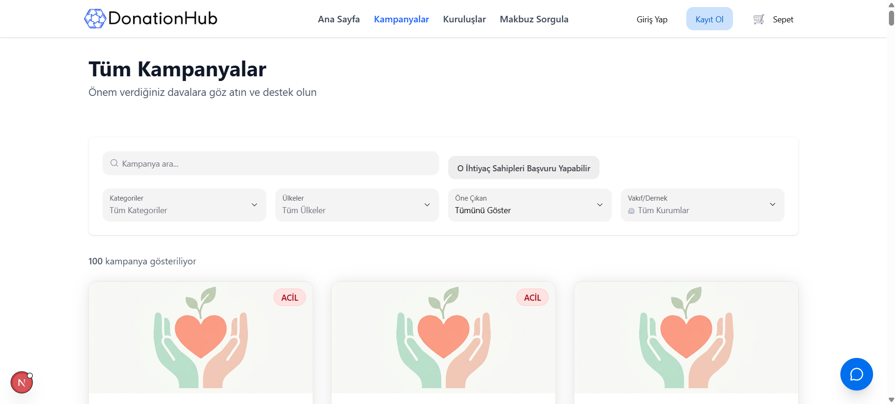
Kategori, bağış türü ve konuma göre filtrelenebilen kampanya listeleme ekranı.

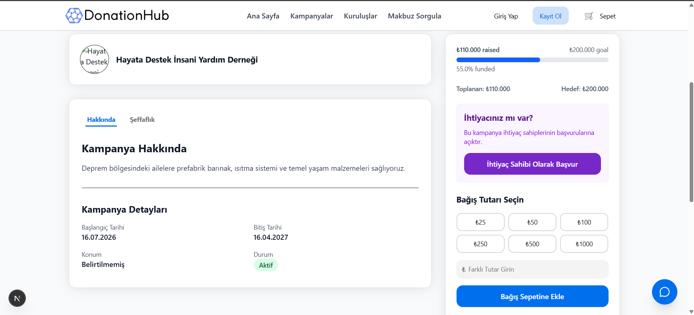
Kampanya hedefi, toplanan miktar, kalan süre ve kuruluş bilgilerinin gösterildiği detay sayfası.

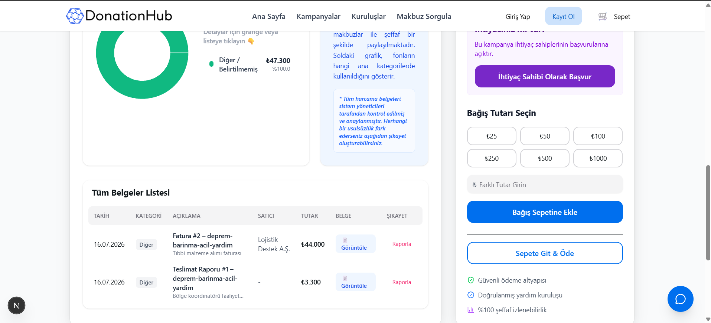
Kampanya harcama kanıtları ve güncelleme akışının listelendiği detay sayfası alt bölümü.

### Bağış & Ödeme
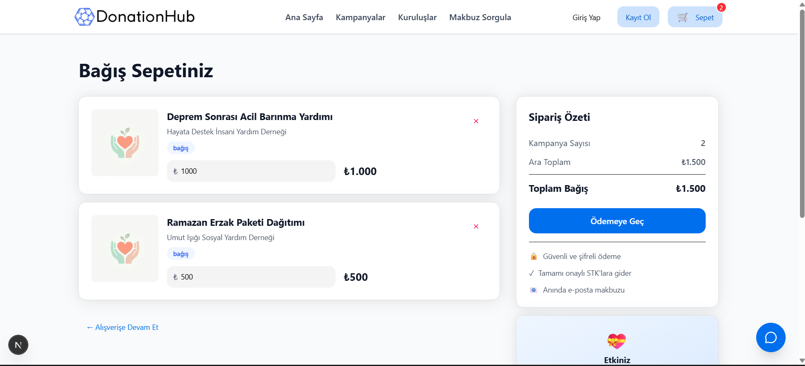
Birden fazla kampanyaya tek seferde bağış yapılabilen sepet ekranı.

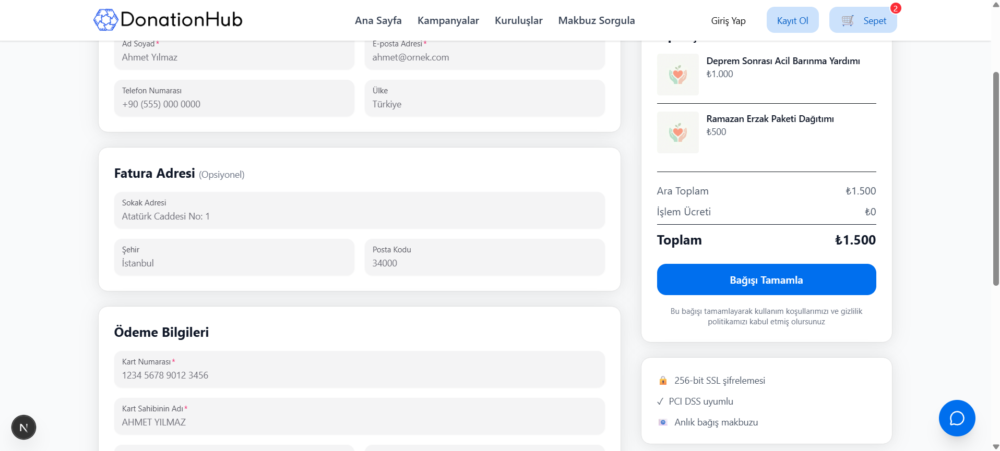
Iyzico 3D Secure entegrasyonuyla güvenli ödeme adımı.

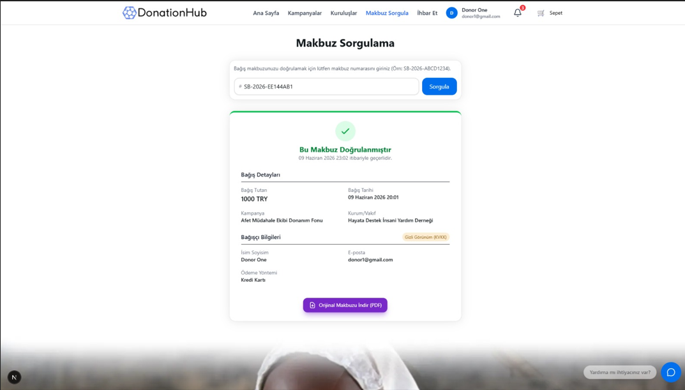
Bağış tamamlandıktan sonra oluşturulan barkodlu dijital makbuz özeti.

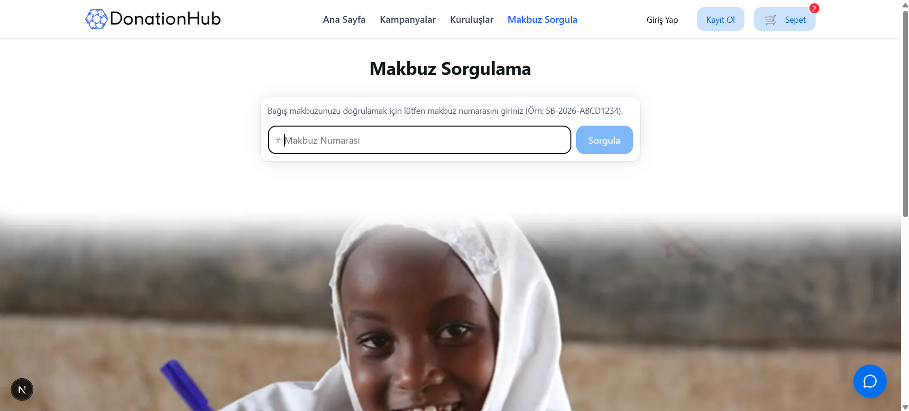
İndirilebilir PDF formatındaki resmi bağış makbuzu görünümü.

### AI Chatbot
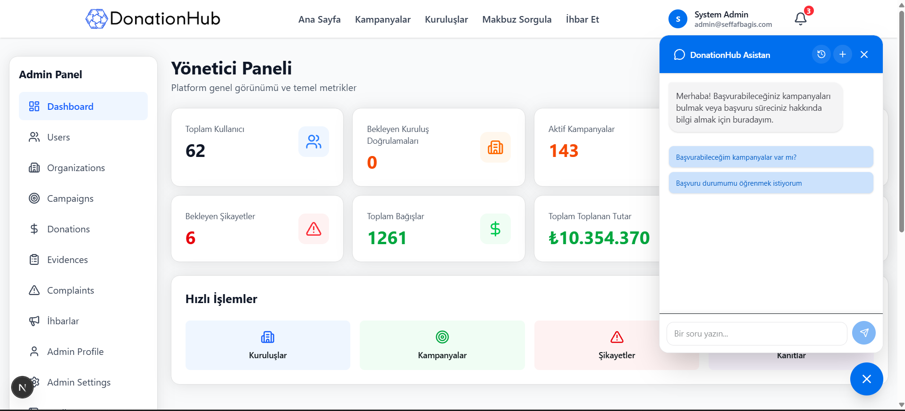
6 tool kullanan, doğal dilde kampanya ve şeffaflık sorgularına yanıt veren AI asistan.

### Vakıf Paneli
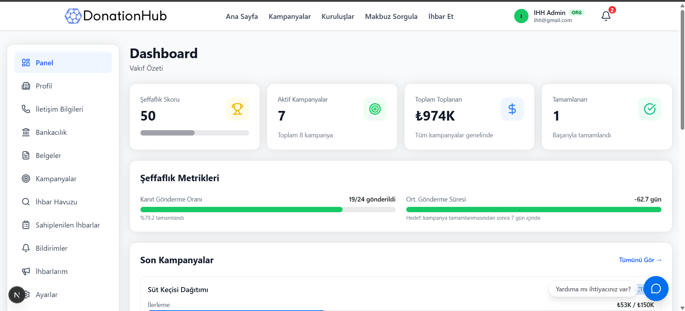
Vakfın bağış istatistikleri, aktif kampanyalar ve şeffaflık skorunu gösteren panel.

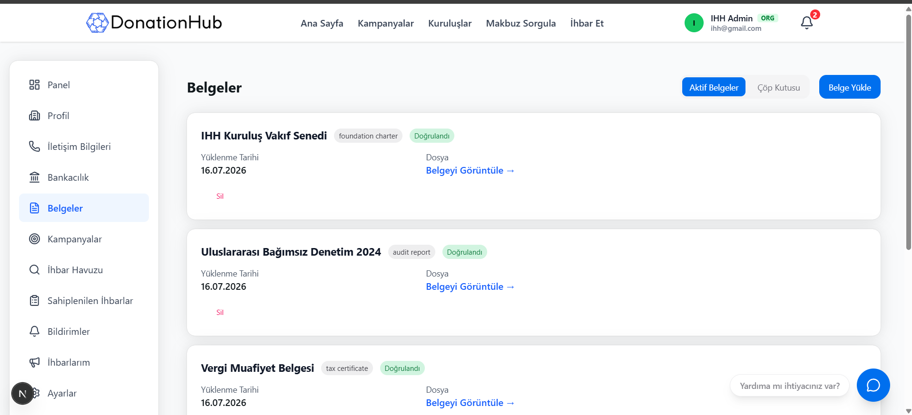
Başvuru yönetimi ve finansal özet bilgilerinin yer aldığı vakıf paneli alt bölümü.

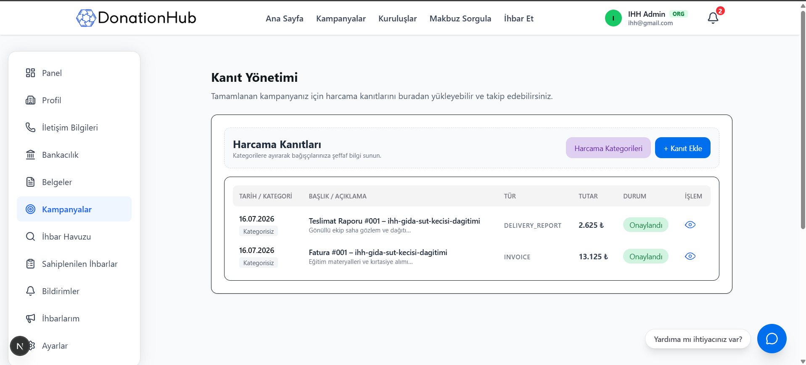
Kampanya harcamalarına ait fatura ve makbuzların yüklendiği kanıt yönetim ekranı.

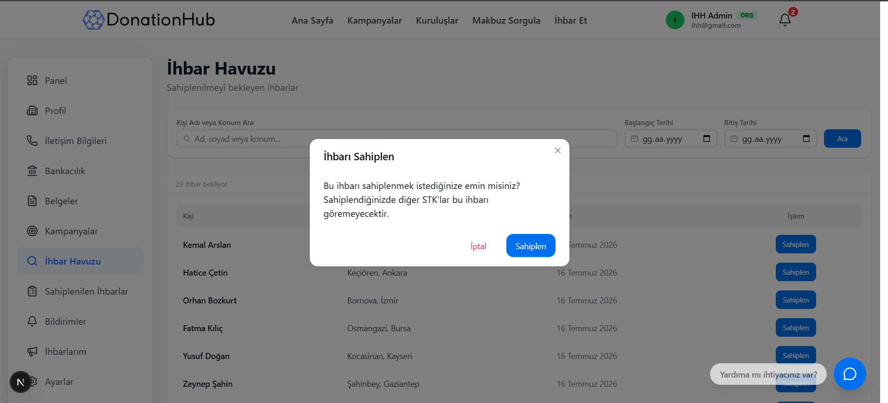
Vakıfların bekleyen ihbarları görüntüleyip sahiplenebildiği ihbar havuzu.

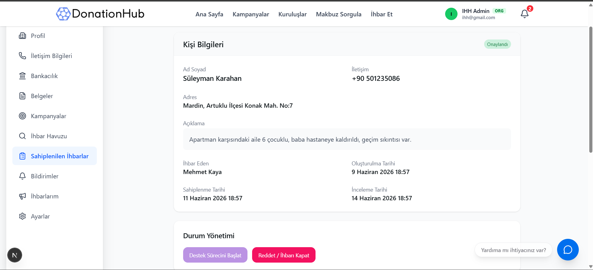
Sahiplenilen ihbarın detayları, ihtiyaç kalemleri ve süreç takibinin yapıldığı ekran.

### Admin Paneli
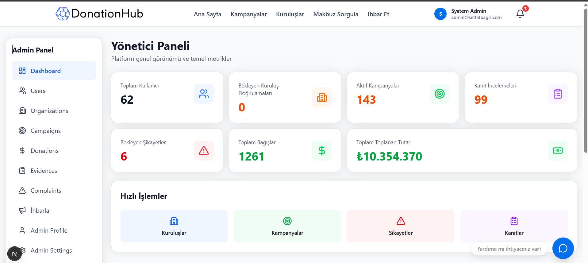
Platform geneli kullanıcı, kampanya ve bağış istatistiklerinin gösterildiği yönetim paneli.

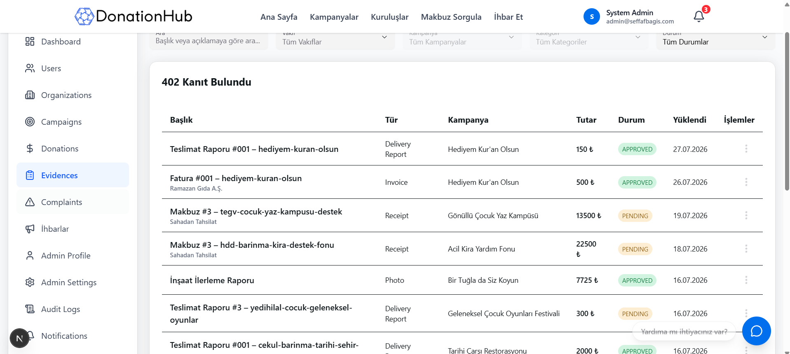
Adminlerin vakıf tarafından yüklenen harcama kanıtlarını incelediği ekran.

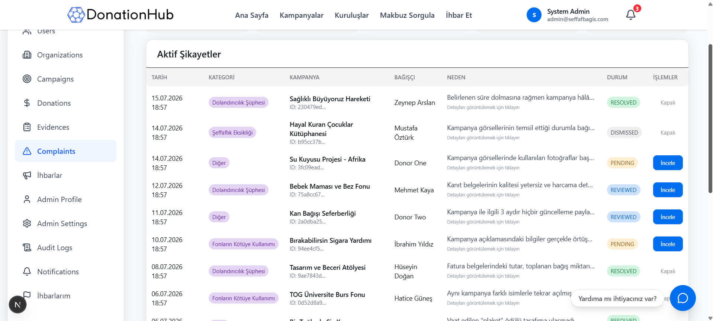
Kullanıcıların kampanyalara yönelik şikayetlerinin değerlendirildiği yönetim ekranı.

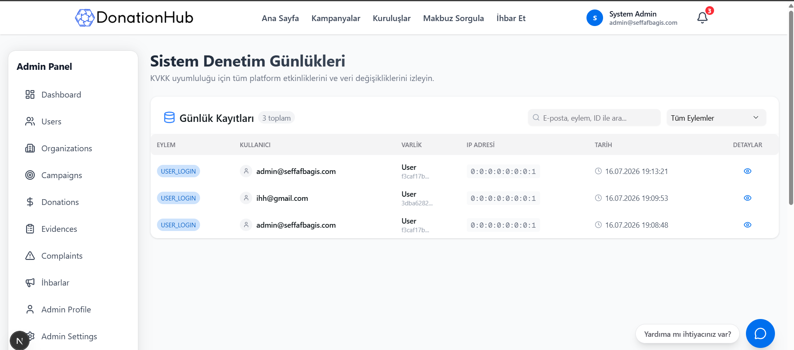
Platform genelindeki kritik işlemlerin kaydedildiği denetim günlüğü.

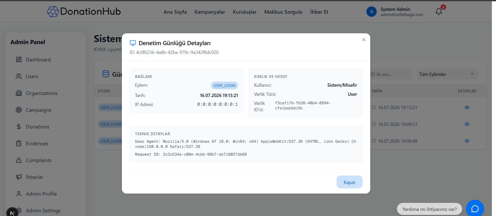
Denetim günlüğünün filtreleme ve detay görüntüleme özellikleriyle genişletilmiş görünümü.

---

## 🔥 Öne Çıkan Modüller

### 1. 🤖 AI Chatbot — Akıllı Şeffaflık Asistanı

LLM Function Calling tabanlı, platform verisini doğal dille sorgulayan asistan.

**6 Tool Tanımı:**

| Tool | Açıklama |
|------|----------|
| `search_campaigns` | Şehir, kategori, bağış türü filtreleriyle kampanya arama |
| `get_campaign_detail` | Kampanya detayı (hedef, toplanan, bitiş tarihi) |
| `get_organization_info` | Vakıf profili ve şeffaflık skoru |
| `get_campaign_transparency` | Kampanyanın harcama kanıtları |
| `list_categories` | Aktif kampanya kategorileri |
| `list_donation_types` | Bağış türleri (Zekat, Sadaka, Fitre vb.) |

**5 Katmanlı Güvenlik:**
1. Input Sanitization — zararlı karakter temizliği
2. System Prompt — rol sınırlandırma
3. Output Sanitization — yanıt denetimi
4. Rate Limiter — dakikada 10 istek (dev: 30)
5. Parameter Whitelist — tool parametresi doğrulama

**Teknik Detaylar:**
- Provider: Groq API (OpenAI uyumlu) — `llama-3.3-70b-versatile`
- Fallback model: `llama-3.1-8b-instant`
- Redis'te 30 dakika TTL, max 15 mesaj geçmiş
- KVKK gereği sohbet geçmişi DB'ye kalıcı kaydedilmez

---

### 2. 📢 İhbar Hattı (Referral System)

Herhangi birinin yardıma ihtiyaç duyan kişileri sisteme bildirebildiği, vakıfların bu ihbarları havuzdan sahiplenerek yönettiği modül.

**Önemli Detaylar:**
- Havuzdaki ihbarlarda kişisel veriler (ad, telefon, adres) **vakıf sahiplenene kadar maskelenir**
- `StringUtils.maskEmail()` → `fu***n@example.com`
- `StringUtils.maskPhone()` → `+90 532 *** ** 67`
- Sadece `APPROVED` statüsündeki vakıflar havuzu görebilir
- İhtiyaç kalemleri (Gıda, Nakit, Isınma vb.) ihbara bağlanabilir

---

### 3. 🙋 İhtiyaç Sahibi Başvuru Modülü

Muhtaç bireylerin vakıf kampanyalarına güvenli şekilde başvurabildiği profil + başvuru sistemi.

**Akış:**
1. Kullanıcı `BeneficiaryProfile` oluşturur (adres, gelir/gider, ihtiyaçlar, belgeler — JSONB)
2. Kampanyaya başvururken profil verisi otomatik kullanılır, form sıfırdan doldurulmaz
3. Zorunlu belgeler sisteme yüklenir: T.C. Kimlik, İkametgah, Muhtaçlık, SGK dökümü
4. Vakıf personeli başvuruyu inceler ve onaylar/reddeder

---

### 4. 🏅 Şeffaflık Skoru

Vakıfların harcama şeffaflığını ölçen algoritmik puanlama sistemi.

- Skor 0–100 arasında hesaplanır
- **Eşik değer 40:** Bu puanın altındaki vakıflar yeni kampanya oluşturamaz
- Kanıt yükleme, kampanya tamamlama ve doküman eksiksizliği değerlere yansır
- Skor geçmişi grafik olarak sunulur
- Platform geneli sıralama tablosu (leaderboard) herkese açıktır

---

### 5. 💳 Ödeme & Makbuz

- **Iyzico 3D Secure** entegrasyonu
- Barkodlu PDF bağış makbuzu (doğrulanabilir makbuz numarasıyla)
- `GET /api/v1/receipts/{receiptNumber}/verify` — herkese açık doğrulama
- Periyodik bağış: haftalık/aylık abonelik, duraklatma/devam ettirme
- Banka havalesi referans takibi

---

## 🔒 Güvenlik & KVKK

### Şifreleme

| Veri | Yöntem |
|------|--------|
| Kullanıcı şifresi | BCrypt (strength: 12) |
| TC Kimlik | AES-256-GCM (uçtan uca şifreli) |
| Telefon numarası | AES-256-GCM |
| Adres bilgisi | AES-256-GCM |
| IBAN | Masked (TR** **** ... **34) |

### JWT Yapısı

```
Access Token  → 15 dakika (900,000 ms)
Refresh Token → 7 gün (604,800,000 ms)
Algorithm     → HMAC-SHA512 (512-bit secret)
Header        → Authorization: Bearer <token>
```

### Rate Limiting

| Endpoint Grubu | Limit |
|----------------|-------|
| Public API | 60 istek/dakika |
| Authenticated API | 300 istek/dakika |
| AI Chatbot | 10 istek/dakika |
| AI Chatbot (dev) | 30 istek/dakika |
| Daily token limit | 100,000 token |

### KVKK Uyumluluğu

- Hassas veriler (TC No, Adres) AES-256-GCM ile şifreli saklanır
- Sohbet geçmişi DB'ye yazılmaz — sadece Redis'te 30 dk tutulur
- Özel nitelikli veriler için (Sağlık, Engellilik raporları) açık rıza zorunlu
- Kişisel veriler API response'larda maskelenerek döner
- Hesap silme desteği (`DELETE /api/v1/users/me`)

### Güvenli Dosya Depolama

- Yüklenen belgeler public klasörde **barındırılmaz**
- Token tabanlı erişim linkleri ile korunur
- Maksimum dosya boyutu: 10 MB (istek: 50 MB)

---

## 🌐 API Referansı

**Base URL:** `http://localhost:8089/api/v1`  
**Format:** `{"success": true, "message": "...", "data": {...}}`  
**Swagger UI:** `http://localhost:8089/swagger-ui.html` (sadece dev profili)

### 🔐 Kimlik Doğrulama — `/api/v1/auth`

| Method | Endpoint | Açıklama | Auth |
|--------|----------|----------|------|
| POST | `/register` | Kullanıcı kaydı | Public |
| POST | `/register/organization` | Vakıf kaydı | Public |
| POST | `/login` | Giriş | Public |
| POST | `/refresh` | Token yenile | Public |
| POST | `/logout` | Çıkış | ✅ |
| POST | `/change-password` | Şifre değiştir | ✅ |
| POST | `/forgot-password` | Şifre sıfırlama isteği | Public |
| POST | `/reset-password` | Şifre sıfırlama | Public |
| POST | `/verify-email` | E-posta doğrulama | Public |
| POST | `/resend-verification` | Doğrulama e-postası tekrar gönder | Public |

### 👤 Kullanıcı — `/api/v1/users`

| Method | Endpoint | Açıklama | Auth |
|--------|----------|----------|------|
| GET | `/me` | Mevcut kullanıcı özeti | ✅ |
| GET | `/me/detail` | Kullanıcı tam detayı | ✅ |
| PUT | `/profile` | Profil güncelleme | ✅ |
| DELETE | `/me` | Hesap silme | ✅ |
| GET/PUT | `/me/profile` | Profil detayı | ✅ |
| GET/PUT | `/sensitive-data` | Şifreli kişisel veriler | ✅ |

### 📣 Kampanyalar — `/api/v1/campaigns`

| Method | Endpoint | Açıklama | Auth |
|--------|----------|----------|------|
| GET | `/` | Kampanya listesi (sayfalı) | Public |
| GET | `/featured` | Öne çıkan kampanyalar | Public |
| GET | `/urgent` | Acil kampanyalar | Public |
| GET | `/search` | Arama + filtre | Public |
| GET | `/summary-stats` | Platform istatistikleri | Public |
| GET | `/{slug}` | Slug ile kampanya detayı | Public |
| GET | `/{id}/stats` | Kampanya istatistikleri | Public |
| POST | `/` | Kampanya oluştur | FOUNDATION |
| PUT | `/{id}` | Kampanya güncelle | FOUNDATION |
| POST | `/{id}/submit` | Onaya gönder | FOUNDATION |
| PUT | `/{id}/pause` | Duraklat | FOUNDATION |
| PUT | `/{id}/resume` | Devam ettir | FOUNDATION |
| PUT | `/{id}/complete` | Tamamla | FOUNDATION |
| POST | `/{id}/watch` | Takip et/bırak | ✅ |
| GET | `/watched` | Takip edilenler | ✅ |

### 💰 Bağışlar — `/api/v1/donations`

| Method | Endpoint | Açıklama | Auth |
|--------|----------|----------|------|
| POST | `/` | Bağış oluştur | Public/✅ |
| GET | `/my` | Bağış geçmişim | ✅ |
| GET | `/my/{id}` | Bağış detayı | ✅ |
| GET | `/{id}/receipt` | Makbuz | ✅ |
| POST | `/{id}/refund` | İade talebi | ✅ |
| GET | `/campaign/{id}/donors` | Kampanya bağışçıları | Public |
| POST | `/recurring` | Periyodik bağış oluştur | ✅ |
| PUT | `/recurring/{id}/pause` | Periyodik bağış durdur | ✅ |

### 💳 Ödeme — `/api/v1/payments`

| Method | Endpoint | Açıklama | Auth |
|--------|----------|----------|------|
| POST | `/initialize` | 3DS ödeme başlat | Public |
| POST | `/direct` | Direkt ödeme | Public |
| POST | `/callback/3ds` | 3DS geri dönüş | Public |
| GET | `/{transactionId}` | İşlem sorgula | Public |
| POST | `/cards` | Kart kaydet | ✅ |
| GET | `/cards` | Kayıtlı kartlar | ✅ |
| DELETE | `/cards/{token}` | Kart sil | ✅ |

### 🏢 Kuruluşlar — `/api/v1/organizations`

| Method | Endpoint | Açıklama | Auth |
|--------|----------|----------|------|
| GET | `/` | Onaylı vakıf listesi | Public |
| GET | `/featured` | Öne çıkan vakıflar | Public |
| GET | `/{id}` | Vakıf detayı | Public |
| GET | `/me` | Kendi vakfım | FOUNDATION |
| PUT | `/me` | Vakıf güncelle | FOUNDATION |
| POST | `/me/verify` | Doğrulama başvurusu | FOUNDATION |

### 📢 İhbar — `/api/v1/referrals`

| Method | Endpoint | Açıklama | Auth |
|--------|----------|----------|------|
| POST | `/` | İhbar oluştur | ✅ |
| GET | `/my` | Kendi ihbarlarım | ✅ |
| GET | `/pool` | İhbar havuzu | FOUNDATION |
| POST | `/{id}/claim` | İhbar sahiplen | FOUNDATION |
| PUT | `/{id}/status` | Durum güncelle | FOUNDATION |
| POST | `/{id}/needs` | İhtiyaç kalemi ekle | FOUNDATION |
| GET | `/foundation/claimed` | Sahiplenilen ihbarlar | FOUNDATION |

### 🤖 Chatbot — `/api/v1/chat`

| Method | Endpoint | Açıklama | Auth |
|--------|----------|----------|------|
| POST | `/message` | Mesaj gönder | ✅ |
| GET | `/conversations` | Sohbet listesi | ✅ |
| GET | `/conversations/{id}/messages` | Mesajlar | ✅ |
| DELETE | `/history/{conversationId}` | Sohbet sil | ✅ |

### 🏅 Şeffaflık — `/api/v1/transparency`

| Method | Endpoint | Açıklama | Auth |
|--------|----------|----------|------|
| GET | `/organization/{id}` | Vakıf şeffaflık skoru | Public |
| GET | `/leaderboard` | Sıralama tablosu | Public |
| GET | `/my` | Kendi skorumu | FOUNDATION |
| GET | `/my/history` | Skor geçmişi | FOUNDATION |
| GET | `/my/can-create-campaign` | Kampanya açabilir mi? | FOUNDATION |

### 🙋 İhtiyaç Sahibi — `/api/v1/beneficiary` & `/api/v1/applications`

| Method | Endpoint | Açıklama | Auth |
|--------|----------|----------|------|
| GET | `/beneficiary/profile` | Profil getir | ✅ |
| PUT | `/beneficiary/profile` | Profil oluştur/güncelle | ✅ |
| POST | `/beneficiary/documents` | Belge yükle | ✅ |
| GET | `/beneficiary/dashboard` | Dashboard | ✅ |
| POST | `/applications` | Başvuru oluştur | ✅ |
| GET | `/applications/my` | Başvurularım | ✅ |
| POST | `/applications/{id}/documents` | Başvuru belgesi | ✅ |
| GET | `/applications/assigned` | Vakfın başvuruları | FOUNDATION |

### 🛠️ Admin — `/api/v1/admin`

| Endpoint | Açıklama |
|----------|----------|
| `GET /dashboard/stats` | Platform özet istatistikleri |
| `GET/PUT /campaigns` | Kampanya listeleme ve onaylama |
| `PUT /campaigns/{id}/featured` | Öne çıkar |
| `GET /organizations` | Vakıf listesi |
| `GET /organizations/pending` | Onay bekleyenler |
| `PUT /organizations/{id}/verify` | Vakıf onayla/reddet |
| `GET /users` | Kullanıcı yönetimi |
| `PUT /users/{id}/role` | Rol değiştir |
| `GET /complaints` | Şikayetler |
| `PUT /complaints/{id}/resolve` | Şikayet çöz |
| `GET /audit-logs` | Denetim günlükleri |
| `GET /referrals` | İhbar yönetimi |

---

## 🗄️ Veritabanı

**70+ Flyway migrasyon** ile yönetilen, UUID birincil anahtar mimarisine sahip PostgreSQL şeması.

### Temel Tablo Grupları

```
👤 Kullanıcı
├── users
├── user_profiles
├── user_sensitive_data       (AES-256-GCM şifreli)
├── user_preferences
├── login_history
├── refresh_tokens
└── beneficiary_profiles      (JSONB home_status, needs, financial_details)

🏢 Kuruluş
├── organizations
├── organization_bank_accounts
├── organization_contacts
└── organization_documents

📣 Kampanya
├── campaigns
├── campaign_images
├── campaign_updates
├── campaign_categories       (M:N)
├── campaign_donation_types   (M:N)
├── campaign_followers
├── campaign_locations
└── campaign_expenditure_categories

💰 Bağış & Ödeme
├── donations
├── donation_receipts
├── transactions
├── payment_sessions
├── recurring_donations
└── bank_transfer_references

📢 İhbar
├── referrals
├── referral_logs
└── referral_needs

🏅 Şeffaflık
├── transparency_scores
└── transparency_score_history

📋 Başvuru & Kanıt
├── applications
├── application_documents
└── evidences

🔔 Bildirim & İletişim
├── notifications
├── email_logs
├── chat_conversations        (Redis TTL, DB'de meta)
├── chat_messages
└── contact_messages

📑 Denetim
└── audit_logs
```

### Şema Diyagramı

```
users ──1:1── user_profiles
  │   ──1:1── user_sensitive_data
  │   ──1:1── organizations ──1:N── campaigns ──1:N── donations
  │                          │                  ──1:N── evidences
  │                          │                  ──1:N── applications
  │                          └──1:1── transparency_scores
  └───────────────────────────────── referrals
                                     beneficiary_profiles
```

> Tüm şema: [`docs/database_schema.sql`](docs/database_schema.sql)

---

## ⚙️ Kurulum

### Gereksinimler

| Araç | Versiyon |
|------|----------|
| Docker & Docker Compose | 24+ |
| Java | 17+ |
| Node.js | 18+ |
| Maven | 3.8+ |

---

### 1️⃣ Repository'yi Klonla

```bash
git clone https://github.com/kullanici/seffaf-bagis-platformu.git
cd seffaf-bagis-platformu
```

---

### 2️⃣ Docker ile Altyapıyı Başlat

```bash
docker compose -f docker/docker-compose.yml up -d
```

| Servis | Port | Detay |
|--------|------|-------|
| PostgreSQL | `5435` | DB: `seffaf_bagis_db` |
| Redis | `6379` | Chatbot hafızası + cache |

Durum kontrolü:
```bash
docker ps
```

---

### 3️⃣ Backend — Ortam Değişkenlerini Ayarla

```bash
cd backend
cp .env.example .env
# .env dosyasını düzenle (bkz. Ortam Değişkenleri bölümü)
```

Backend'i başlat:

```bash
# Linux/macOS
./start_backend.sh

# Windows (PowerShell)
.\start_backend.ps1

# Manuel
mvn spring-boot:run -Dspring-boot.run.profiles=dev
```

Sağlık kontrolü:
```bash
curl http://localhost:8089/actuator/health
# {"status":"UP"}
```

Swagger UI:
```
http://localhost:8089/swagger-ui.html
```

---

### 4️⃣ Frontend — Ortam Değişkenlerini Ayarla

```bash
cd frontend
```

`.env.local` oluştur:
```env
NEXT_PUBLIC_API_URL=http://localhost:8089/api/v1
```

Bağımlılıkları yükle ve başlat:
```bash
npm install
npm run dev
```

Platform:
```
http://localhost:3000
```

---

### 5️⃣ İlk Admin Hesabı

Flyway migration'ları ilk çalıştırmada otomatik uygulanır. Admin hesabı oluşturmak için:

```sql
-- seffaf_bagis_db üzerinde çalıştır
UPDATE users SET role = 'ADMIN' WHERE email = 'senin@email.com';
```

---

## 🔧 Ortam Değişkenleri

`backend/.env.example` dosyasını kopyalayarak `.env` oluştur:

```env
# ── Veritabanı ────────────────────────────────────────────
SPRING_DATASOURCE_URL=jdbc:postgresql://localhost:5435/seffaf_bagis_db
SPRING_DATASOURCE_USERNAME=postgres
SPRING_DATASOURCE_PASSWORD=postgres

# ── Redis ─────────────────────────────────────────────────
REDIS_HOST=localhost
REDIS_PORT=6379
REDIS_PASSWORD=

# ── JWT ───────────────────────────────────────────────────
APP_JWT_SECRET=           # min 512-bit hex string

# ── E-posta (SMTP) ────────────────────────────────────────
MAIL_HOST=smtp.gmail.com
MAIL_PORT=587
MAIL_USERNAME=            # Gmail adresi
MAIL_PASSWORD=            # Gmail App Password
MAIL_FROM=noreply@seffafbagis.org

# ── Şifreleme ─────────────────────────────────────────────
ENCRYPTION_SECRET_KEY=    # tam 32 karakter

# ── CORS ──────────────────────────────────────────────────
CORS_ALLOWED_ORIGINS=http://localhost:3000,http://127.0.0.1:3000

# ── LLM / Chatbot ─────────────────────────────────────────
LLM_PROVIDER=openai                                    # openai veya gemini
LLM_MODEL=llama-3.3-70b-versatile
LLM_API_KEY=                                           # Groq API anahtarı
LLM_API_URL=https://api.groq.com/openai/v1/chat/completions
LLM_FALLBACK_MODEL=llama-3.1-8b-instant

# ── Ödeme (Iyzico Sandbox) ────────────────────────────────
IYZICO_API_KEY=sandbox-api-key
IYZICO_SECRET_KEY=sandbox-secret-key
IYZICO_BASE_URL=https://sandbox-api.iyzipay.com
IYZICO_CALLBACK_URL=http://localhost:8089/api/payment/callback

# ── Spring ────────────────────────────────────────────────
SPRING_PROFILES_ACTIVE=dev
```

> **Not:** Groq ücretsiz tier — 14,400 istek/gün, kayıt: [console.groq.com](https://console.groq.com)

---

<div align="center">

**Şeffaf Bağış Platformu** — Güvenle Bağış Yapın, Kanıtlarla İzleyin.

</div>
